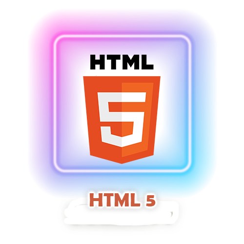
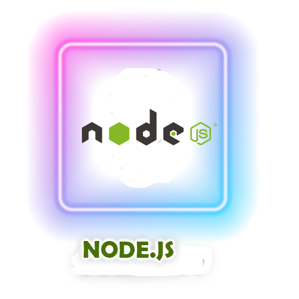
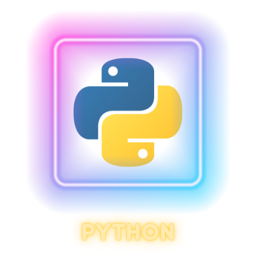
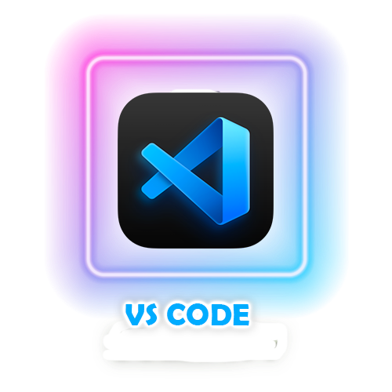

<!--- assets are created on Canva & Photoshop--->
<!--- Feel free to download the assets and use them in your profile --->
<!--- to upload an asset, create an issue on any of your repositories and add files, the link will be generated --->

<!--- animated text, to copy, just replace the lines with your choice or visit https://readme-typing-svg.herokuapp.com --->
  
<!---

--->
  
<!--- header image --->

  

  

  
<!--- portfolio launch image --->
  

  
<!--- social media icons, you can find them in the assets directory of this repo --->
  
 
  
 

  

  

  

 

  
<!--- a bit of vertical space & languages text --->
  

&nbsp;

  

  
  
<!--- language icons --->
  
  
<!--- 

 
--->
  

  
&nbsp;
<h1 align="center">
  ABOUT ME
</h1>
  

  
Entered in the wold of technology as a computer science student but not limited to this. Ambitious to excel in other fields of tech as well. I have done courses and internships at various platforms in local as well as global companies🎉. I'm a passionate learner.
  
  <!--- Personal --->  
  
<h1 align="center">
    Personal 
    </h2>
  
Building `Elegant` Open Source Repository and Projects.
  
Bloodline `Creative, Reflective & Introspective` Designer.
  
Aspire `Broke` those with `Excellence` who try to mess up `Soft Heart`.
  
Smarting `Ignorance/absence` those who lose diamond.
  
Believe `in Allah Almighty` Exclusively and Unconditionally.
  
  
  <!--- Education --->  
  
<h1 align="center">
    Education 
    </h2>

  Fifth Semester - `Bachelor` in `Computer Science `(BSCS)` - Nuces (Fast) University Islamabad
  
  `Intermediate` with `95% marks` - Nishat Group of College's Multan 
  
  `Matriculation`  with `97% marks` - Nishat Boys High School Multan

  
  <!--- Portfolio/Website --->  
  
<h1 align="center">
    Portfolio/Website
    </h2>
  
  `Personal Website` -> <a href="https://harisalimughal.netlify.app/" target="_blank">`Haris Ali Mughal`</a>
  
  `credibleinfo` -> <a href="https://mycredible.info/#505183863" target="_blank">`Haris Ali Mughal`</a>

  `Figma (UI/UX)` -> <a href="https://www.figma.com/@harisalimughal" target="_blank">`Haris Ali Mughal`</a>
  
  `Linktree` -> <a href="https://linktr.ee/harisali077" target="_blank">`Haris Ali Mughal`</a>
  
  
  <!--- Buy Me a Coffee ☕ ---> 
  
<!--- <h3 align="center"></h3>

 --->

  
  <!--- adding 3D earth icon to show some love for the environment 🌏 --->
  
 
  
 

  
  
  
  
  

<!--- Recent Activity ☂️ ---> 

<h1 align="center">
    Recent Activity ☂️
</h2>

<table align="center">
  <tr> 
    

    <td align="center">
      
<!--START_SECTION:activity-->
 
<!--END_SECTION:activity-->

<h1 align="center">
    Languages Stats ✍✨
    </h1>
    
<table align="center">
  <tr> 
    

    <td align="left">

 </td>
   

  </tr>
</table>

<!--- Github snack contribution graph --->
  

 

<b>Top Repositories</b>

       

 

       

<!--- building footer with spaceship question --->
  

No, It's time to go beyond the stars now🌟

 
 

